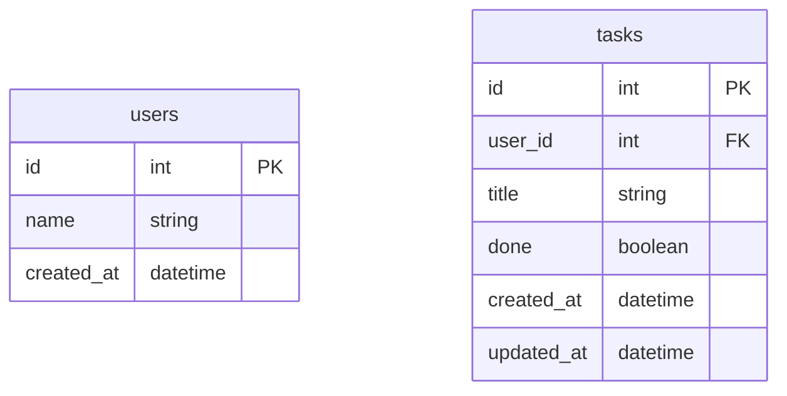

# FastAPI
## FastAPIとは
- 公式ドキュメント
    - https://fastapi.tiangolo.com
- GitHub
    - https://github.com/tiangolo/fastapi
- FastAPIのバージョン
    - 0.88.0

## 作るもの
FastAPIでシンプルなTODOアプリのAPIを作ります
以下のようなデータモデルを想定します



以下のCRUDを用意します
- create a user
- get a user
- get all users
- create a task
- get all tasks for user


## やること
1. プロジェクトを作成する
1. データベースを用意する
1. データベースと接続する設定ファイルを作成する
1. データモデルを定義する
1. Pydanticスキーマを定義する
1. CRUDの処理を用意する
1. ルーティングを定義する
1. マイグレーションを実行する
1. 動作確認する

## 最終的なディレクトリ構成
```
.
├── app
│   ├── crud.py
│   ├── database.py
│   ├── main.py
│   ├── models.py
│   └── schemas.py
├── db
│   ├── alembic.ini
│   ├── development
│   │   ├── README
│   │   ├── env.py
│   │   ├── script.py.mako
│   │   └── versions
│   │       └── 9965d78849e3_first_migration.py
│   └── init
│       └── 1_create_databases.sql
├── docker-compose.yaml
└── requirements.txt
```

