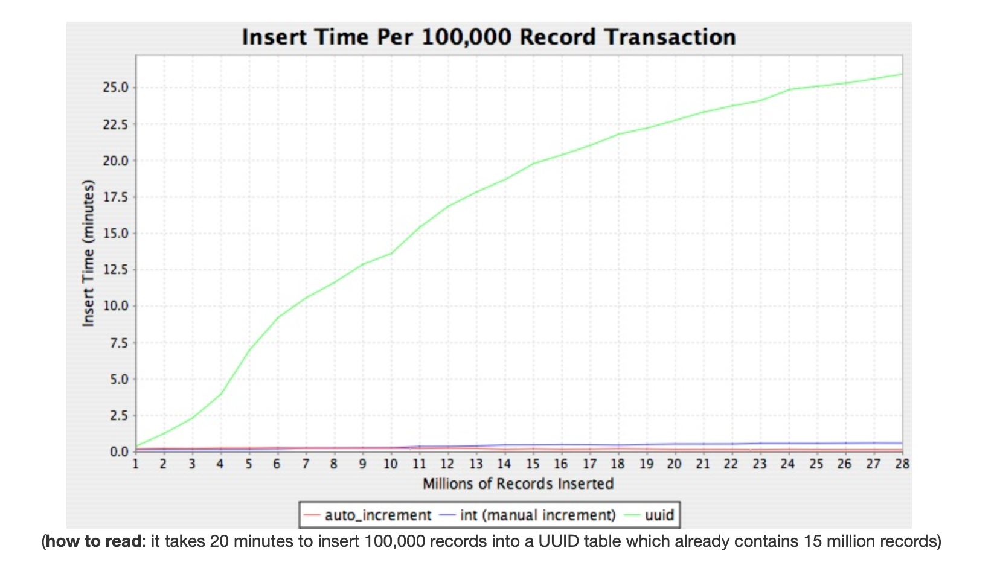
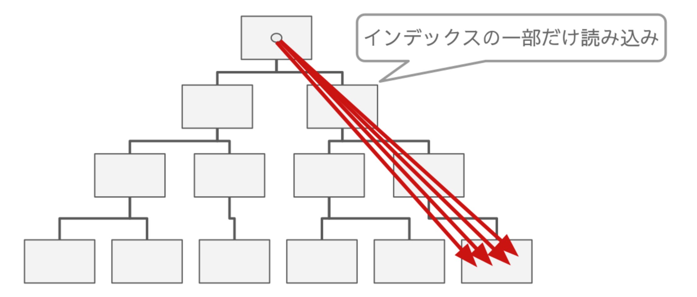
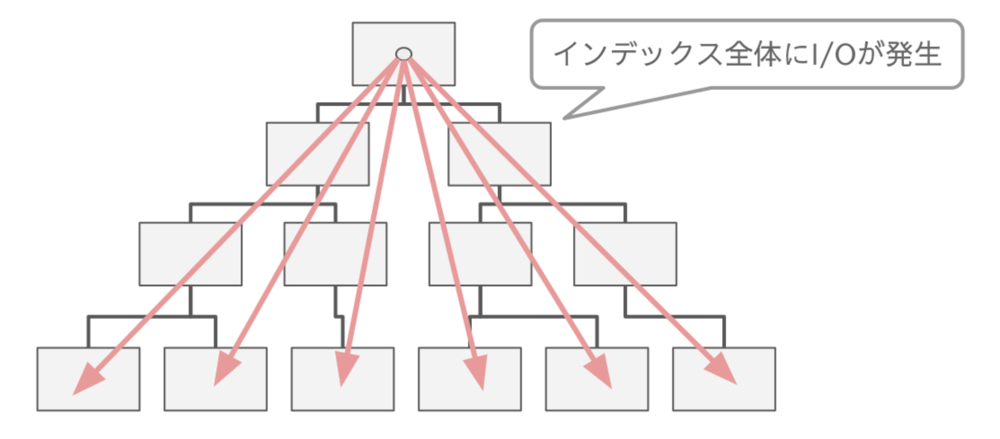
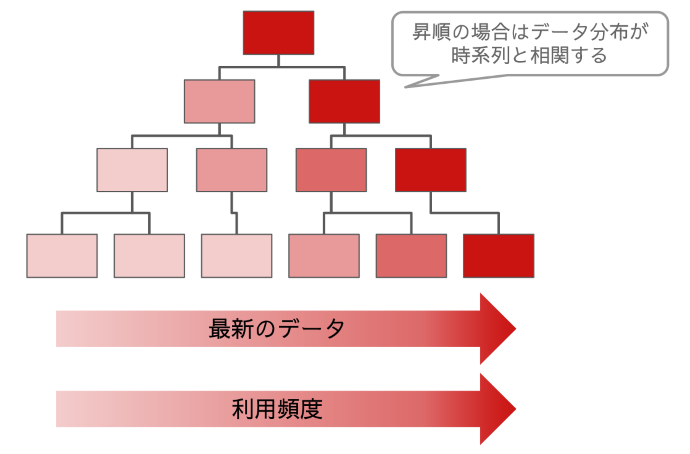

# IDの生成方法
このドキュメントではデータベース保存するIDの生成方法についてまとめます。

## AUTO_INCREMENT
DBがIDを連番で生成する方式

- メリット
    - 数値型で扱える
        - バイトサイズが小さいのでパフォーマンスが有利
    - 連番なのでソート可能
    - インデックスの空間効率がいい
- デメリット
    - INSERTが完了するまでIDがわからない
        - 非同期処理したいときでも先にIDは返したい場合、IDを採番するためだけに先にINSERTしないといけない
    - データ量が増えてDBが複数になった場合、IDが重複する

同時に複数のトランザクションがINSERTしようとしたとき、DBがIDを生成するためにテーブルをロックして、パフォーマンスが悪化する懸念がある
MySQLにはAUTO_INCREMENTのロックモードが3種類あり、MySQL8.0では、 `innodb_autoinc_lock_mode = 2` (「インターリーブ」 ロックモード) がデフォルトで設定される
https://dev.mysql.com/doc/refman/8.0/ja/innodb-auto-increment-handling.html

このロックモードでは、テーブルレベルのロックは取らず、複数のステートメントを同時に実行できるため、高速で拡張性が高い。
ただし、生成された値が連続的でない可能性がある
また、ステートメントベースのレプリケーションを使用する場合や、リカバリシナリオでバイナリログからSQLステートメントを再現する際には、安全ではない

## UUID
アプリケーションがランダムにIDを生成する方式

- メリット
    - アプリケーションがIDを生成するので、採番のためにDBアクセスしなくていい
- デメリット
    - 数値型で扱えない
    - ソートできない
    - インデックスの空間効率が悪い
    - INSERTにかかる時間が増えていく


### INSERTにかかる時間が増えていく
https://kccoder.com/mysql/uuid-vs-int-insert-performance/


https://techblog.raccoon.ne.jp/archives/1627262796.html
AUTO_INCREMENTはシーケンシャルなので、リーフページを集中させることができ、キャッシュのヒット率が高くなる
=> レコードが増えてもパフォーマンスは一定を維持できる


UUIDはシーケンシャルではないので、INSERTするたびにテーブル全体のランダム位置に対するリーフページの読み込みが必要になる
=> レコードが増えるとパフォーマンスが劣化する


読み込み時は、1レコードを取得する場合はAUTO_INCREMENTとUUIDでパフォーマンスに差はない
が、実際は新しいレコードほど頻繁に読み込むことになる
最新のリーフノードほど参照頻度が高くなり、キャッシュヒット率が高くなるので、パフォーマンスが高くなる


UUIDの場合、データの分布は時系列と関係ないので、AUTO_INCREMENTのような恩恵を受けることはできない
MySQL8 の [uuid_to_bin()](https://dev.mysql.com/doc/refman/8.0/ja/miscellaneous-functions.html#function_uuid-to-bin) 関数を使うとほぼシーケンシャルな値にできるらしい

## ULID
UUIDと同じくランダムに値を生成するが、先頭がタイムスタンプ成分になっている方式

- メリット
    - 時系列の並びになるため、UUIDの欠点を克服できる
    - ソートできる
    - 同一ミリ秒内での生成でも、同じミリ秒内に2^80 を超えない限り、ソート順が保証される
- デメリット
    - 数値型で扱えない


## 生成手順
### pythonのULIDライブラリ
https://github.com/ahawker/ulid
```sh
pip install ulid-py
```
```python
>>> import ulid
>>> ulid.new()
<ULID('01GPN7CM2HS8A552Q7DX9D24R7')>
>>> id = ulid.new()
>>> id.str
'01GPN7FK0E0WY9QF46MPK0SRVK' # 26文字
>>> id.int
2023260978905909068547623492420166515
```

## 参考
- https://zenn.dev/j5ik2o/articles/a085ab3e3d0f197f6559
- https://zenn.dev/praha/articles/3c84e3818891c3
- https://techblog.raccoon.ne.jp/archives/1627262796.html
