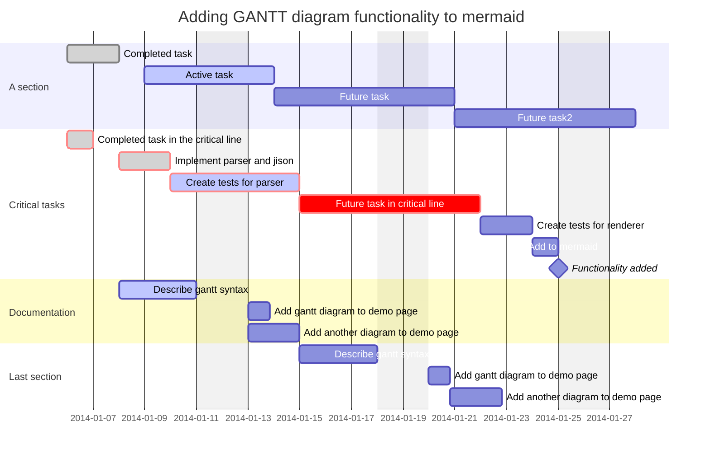

## mermaid example


## UML example
```uml
@startuml
Alice -> Bob: Authentication Request
Bob --> Alice: Authentication Response

Alice -> Bob: Another authentication Request
Alice <-- Bob: another authentication Response
@enduml
```

## code block example
```python
def sum(a, b):
    return a + b

result = sum(10, 20)
print(result)
```


## table example
| column A | column B | column C |
| --- | --- | --- |
| 1 | 2 | 3 |
| A | B | C |

